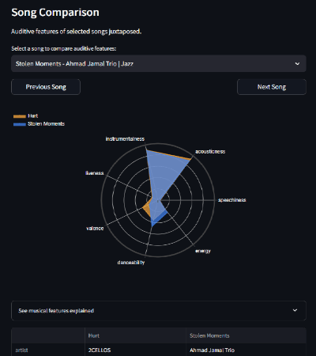
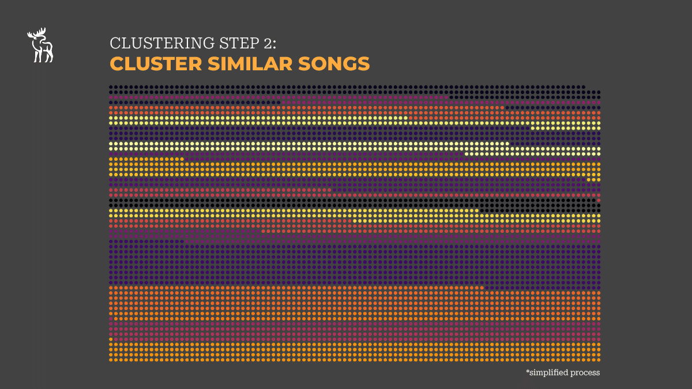
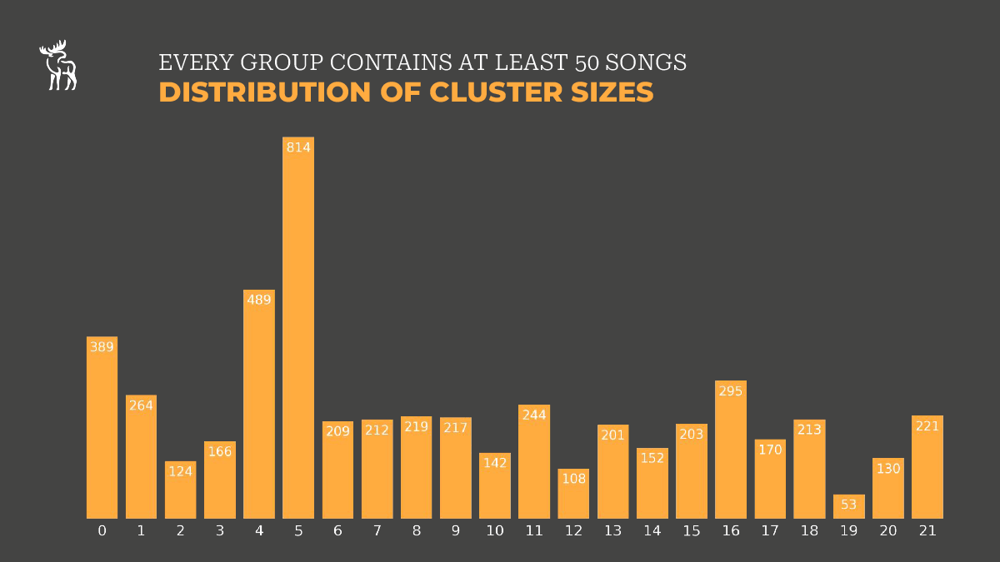

# Moosic Unsupervised Machine Learning Project

## Project Goal

Goal of this project is to support musical experts in a fictional company called *Moosic*.
*Moosic* takes pride in providing manually crafted playlists for music enthusiasts of all genres.
As the starp-up company is growing rapidly their experts struggle to keep the pace and create more and more playlists.
So the idea is to employ a machine learning tool to provide them with preselected songs and simplify their way of working. 

Being part of a data science bootcamp, the intent of this project was getting started in scikit-learn. 
I extended the official goals of the project by also retrieving genre-data using Gemini AI and wrapping everything up in an Online Dashboard-app made with streamlit.

## Results

## Streamlit App

  

 

 

## Project presentation
 
 
 
 
 
 
 
 
 
